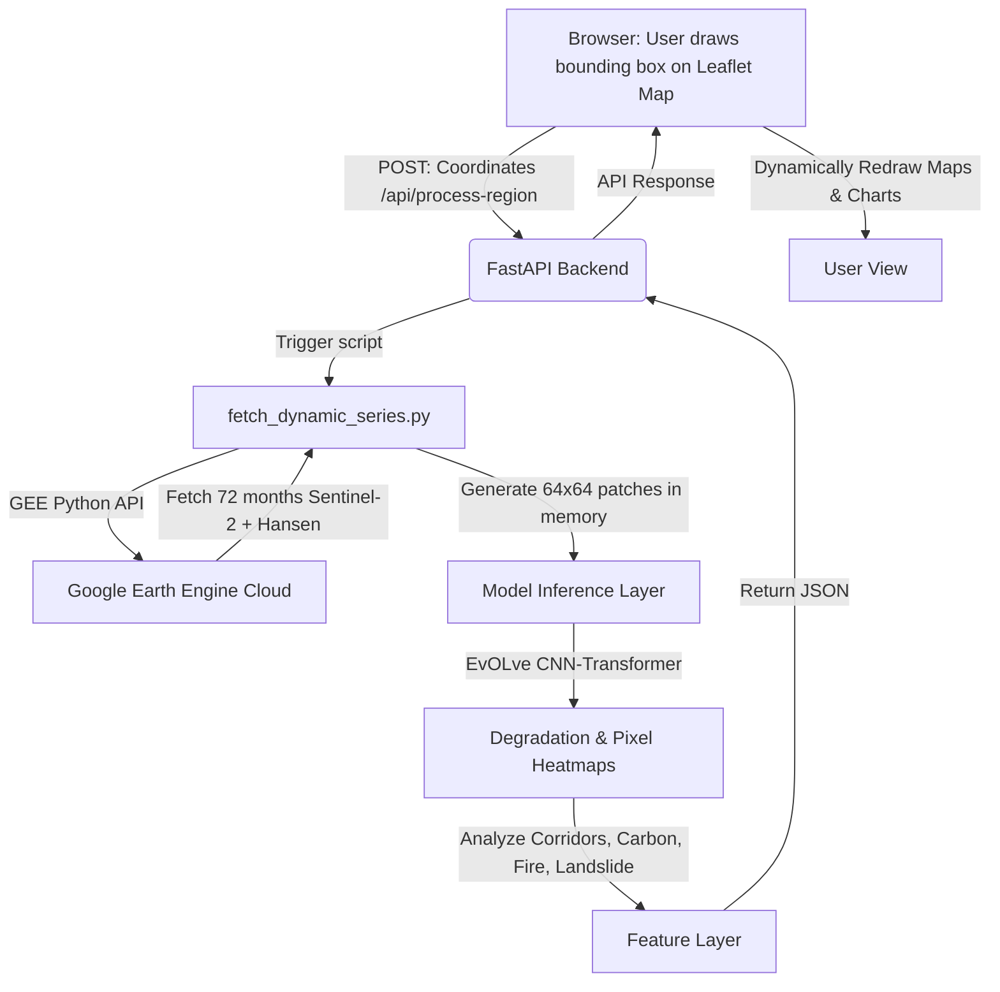

# EvOLve Version 2.0 — Dynamic Global Forest Intelligence
**Real-time Bounding Box Ingestion · On-the-Fly Google Earth Engine Fetching · Live CNN-Transformer Inference**

---

## 🎯 Goal
Upgrade the static forest dashboard (which only monitors a pre-computed grid in Wayanad) into a **dynamic global monitoring platform**. The user should be able to draw or select a bounding box anywhere on Earth in the browser, send it to the backend, and trigger real-time Google Earth Engine (GEE) fetching, model inference, and hazard assessment.

---

## 🏗️ System Architecture Flowchart

---

## 🚀 Key Proposed Changes (Component by Component)

### 1. Leaflet GIS Frontend (React)
- **Map Drawing Tools**: Add `leaflet-draw` or `react-leaflet-draw` to allow drawing a polygon or rectangle on the Leaflet map.
- **Dynamic Grid generation**: Upon drawing, calculate an 8x8 patch grid coordinates locally and overlay them.
- **POST API Trigger**: Send coordinates `[[lat_min, lon_min], [lat_max, lon_max]]` to the FastAPI backend.
- **Loading Overlay**: Introduce a progress spinner: *"Fetching satellite data from Google Earth Engine (est. 1-2 minutes)..."*

---

### 2. FastAPI Backend & Dynamic Ingestion (Python)
- **New endpoint**: `POST /api/process-region`
- **Dynamic Earth Engine Pipeline (`fetch_dynamic_series.py`)**:
  - Authenticate to Earth Engine dynamically using a service account key file.
  - Crop Sentinel-2 monthly composites (B2, B3, B4, B8, B11, B12, NDVI, EVI) for the selected bounding box *on-the-fly*.
  - Align Hansen GFC forest loss labels on-the-fly.
  - Slice the area into 8x8 patches (64 patches) and return them as NumPy tensors in-memory.

---

### 3. Live Model Inference
- **Backend Loader**: The backend loads `classifier.pt` and `encoder_pretrained.pt` once during startup.
- **In-Memory Feed**: Pass the dynamically generated 4D patch tensors `(64, 72, 8, 64, 64)` directly into PyTorch (running on Apple Silicon MPS or CPU).
- **Output**: Predict degradation scores and Grad-CAM pixel heatmaps *live*.

---

### 4. Dynamic Feature Analysis & Landslide Diagnostics
- **Live Corridor connectivity**: Compute adjacency graph for the new drawn coordinates.
- **⛰️ Detailed Landslide Diagnostic Reports**:
  - If a user queries landslide risk at a specific location, GEE will fetch the **SRTM DEM** to compute slope angle, and **CHIRPS Daily Precipitation** to compute antecedent rainfall.
  - The model calculates the hazard probability based on three factors:
    $$\text{Slope Factor} \times \text{Forest Loss (Root Cohesion)} \times \text{Rainfall Load}$$
  - **Explainability engine**: Generates a text diagnostic explaining the exact reason for risk:
    - *Terrain Slopes*: Steeper than 15° increases shear stress.
    - *Canopy Cleared*: Forest loss rate in past 12 months removes root binding.
    - *Soil Moisture*: High SWIR absorption shows saturated soil.
  - Renders a clean PDF report sheet / card layout with specific mitigations (e.g. vetiver grass planting, geo-textiles, drainage channels).
- **Live Carbon Valuation**: Calculate biomass based on the new region's average forest type.

---

## ⚠️ Challenges & Technical Mitigation

| Challenge | Impact | Mitigation Strategy |
|---|---|---|
| **GEE API Latency** | Fetching 72 months of monthly composites on-the-fly can take 1-3 minutes. | 1. Limit the maximum area size to 10km x 10km. 2. Reduce temporal depth option (e.g. let user select last 24 months instead of 72 months for fast runs). 3. Cache results on disk by bounding box hash. |
| **GEE Service Account** | Backend needs authentication. | We will set up a dedicated GEE service account credentials file `.gee_creds.json` and load it inside the backend. |
| **Compute Quota** | Excessive API requests. | Use a rate-limiter on the backend API. |

---

## 🛠️ Implementation Plan

### Step 1: Frontend Drawing Controls
#### [MODIFY] [App.jsx](file:///Users/tejeshneelam/Desktop/evolve-forest-degradation/dashboard/frontend/src/App.jsx) / [ForestMap.jsx](file:///Users/tejeshneelam/Desktop/evolve-forest-degradation/dashboard/frontend/src/components/ForestMap.jsx)
- Install `leaflet-draw`.
- Add drawing toolbars to the Leaflet map.
- Send the bounds to `POST http://localhost:8000/api/process-region`.

### Step 2: GEE Python Integration
#### [NEW] `dashboard/backend/gee_dynamic.py`
- Initialize Google Earth Engine on the backend.
- Define a function `fetch_roi_patches(lat_min, lon_min, lat_max, lon_max)` that returns the patches.

### Step 3: API Integration & Live inference
#### [MODIFY] [main.py](file:///Users/tejeshneelam/Desktop/evolve-forest-degradation/dashboard/backend/main.py)
- Connect `gee_dynamic.py` to the PyTorch inference code.
- Run predictions, compile the 6 features, and return them as a single JSON payload.
